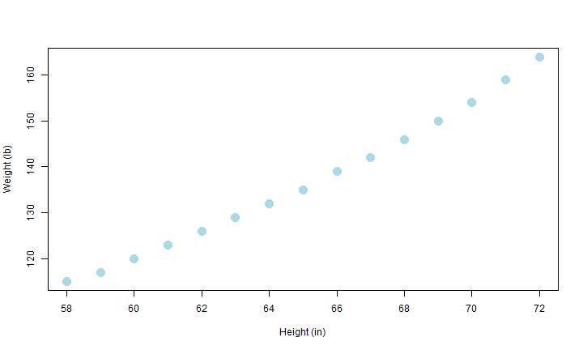
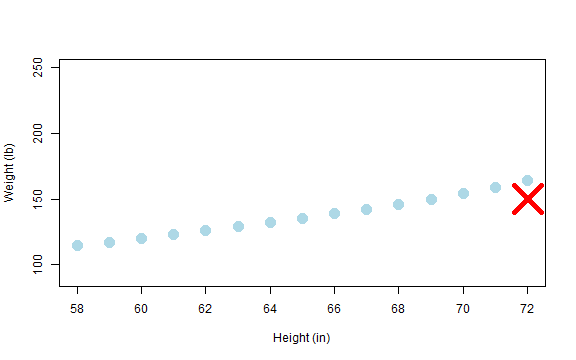

---
title       : Developing Data Products
subtitle    : Course Project-Shiny App Pitch 
author      : 
job         : 
framework   : io2012        # {io2012, html5slides, shower, dzslides, ...}
highlighter : highlight.js  # {highlight.js, prettify, highlight}
hitheme     : tomorrow      # 
widgets     : []            # {mathjax, quiz, bootstrap}
mode        : standalone # {standalone, draft}
knit        : slidify::knit2slides
--- .class #id 

## Intro to my Shiny App
Are you a woman? Do you ever think about your height and weight in relation to others? Have you ever thought to yourself, am I normal? 

Well, I can't guarantee you are 'normal' (who is??) but, with my shiny app you can take a look at where you fall in relation to the average heights and weights of women in the US. 

We'll let you know if, for your height, you are above or below average weight. 

Check out the app [here](https://beaulida2.shinyapps.io/ShinyApp)  
Github link [here](https://github.com/beaulida2/DevDataProd_ShinyApp)

--- .class #id 

## Data

The data used gives the average heights and weights for American women aged 30-39 taken from the American Society of Actuaries Building and Blood Pressure study. Height is reported in inches and weight is reported in lbs.


```r
summary(women$height)
```

```
##    Min. 1st Qu.  Median    Mean 3rd Qu.    Max. 
##    58.0    61.5    65.0    65.0    68.5    72.0
```

```r
summary(women$weight)
```

```
##    Min. 1st Qu.  Median    Mean 3rd Qu.    Max. 
##   115.0   124.5   135.0   136.7   148.0   164.0
```

--- .class #id 

## US women aged 30-39: Average heights and weights
From our data:

 

--- .class #id 

## Where do I fall?
My shiny app can tell you! Simply input your height and weight measurements.  
So, if I'm 6ft (72 in) and 150lbs I just put in my stats and voila!

 

Looks like I'm below average weight for my height. Time for some ice cream!
